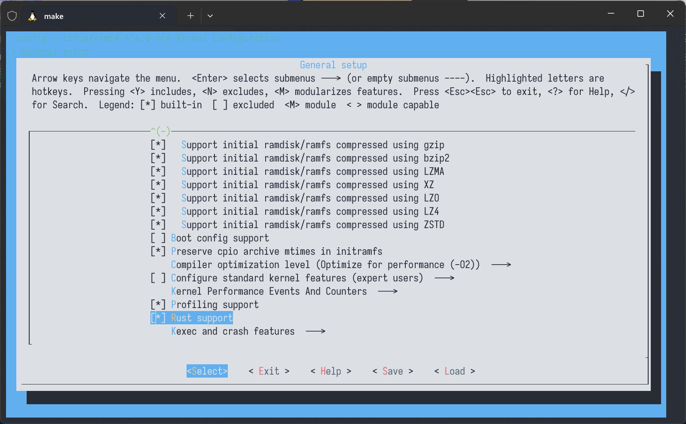
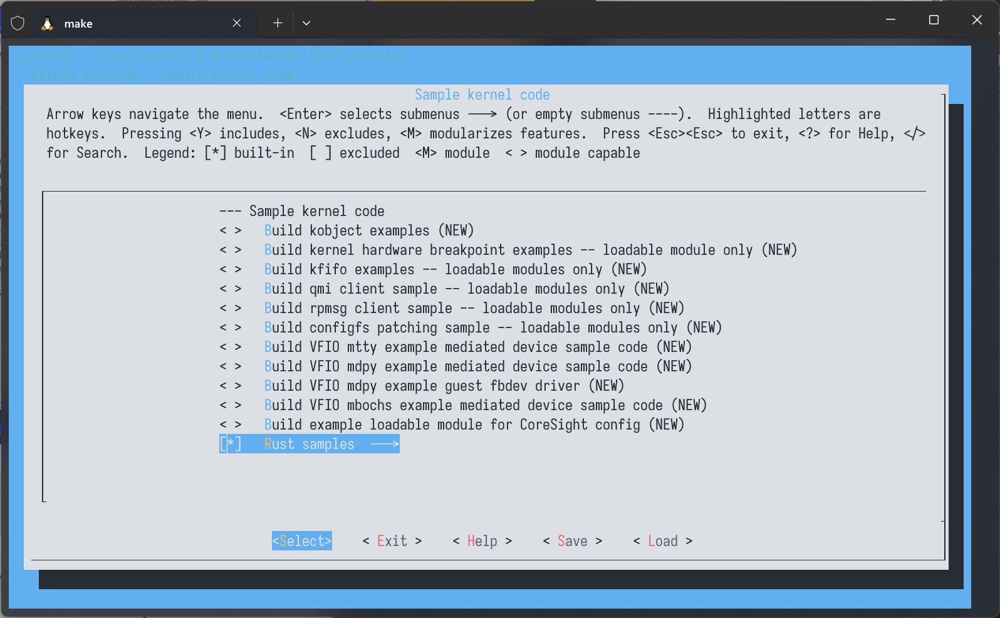
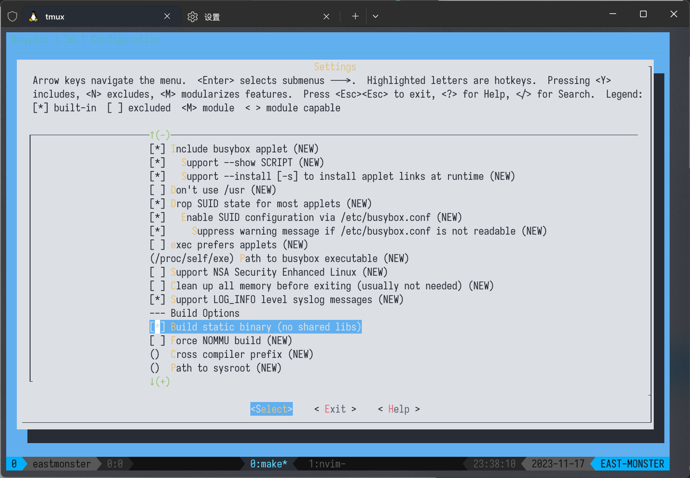
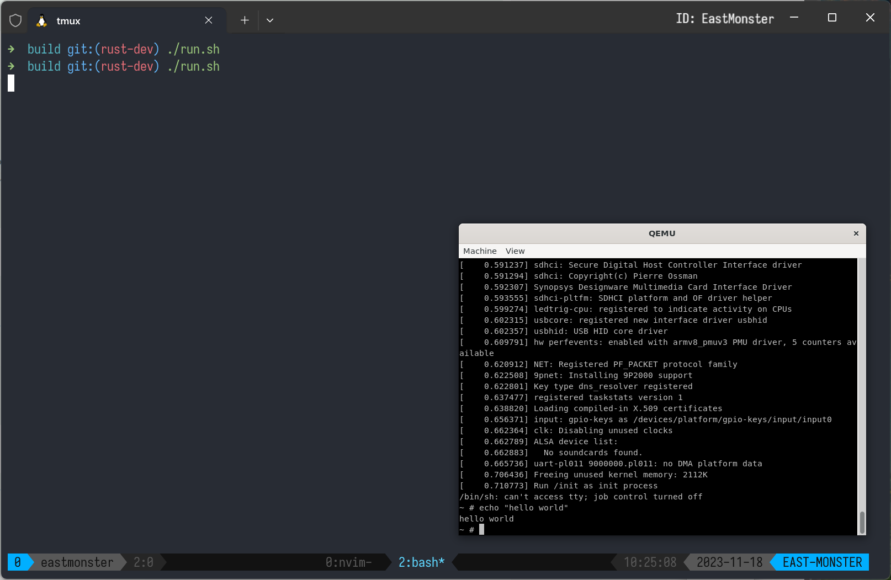

## 练习 1: Rust for Linux 仓库源码获取，编译环境部署，及 Rust 内核编译。之后尝试在模拟器 Qemu 上运行起来。

### 1. 仓库源码获取
```bash
git clone https://github.com/Rust-for-Linux/linux -b rust-dev --depth=1
```

### 2. 准备编译环境
```
sudo apt-get -y install \
  binutils build-essential libtool texinfo \
  gzip zip unzip patchutils curl git \
  make cmake ninja-build automake bison flex gperf \
  grep sed gawk bc \
  zlib1g-dev libexpat1-dev libmpc-dev \
  libglib2.0-dev libfdt-dev libpixman-1-dev libelf-dev libssl-dev
```
安装 LLVM:
```bash
sudo apt-get install clang-format clang-tidy clang-tools clang clangd libc++-dev libc++1 libc++abi-dev libc++abi1 libclang-dev libclang1 liblldb-dev libllvm-ocaml-dev libomp-dev libomp5 lld lldb llvm-dev llvm-runtime llvm python3-clang
```
设置 Rust 工具链:
```bash
cargo install --locked --version $(scripts/min-tool-version.sh bindgen) bindgen-cli
rustup override set $(scripts/min-tool-version.sh rustc)
rustup component add rust-src
make LLVM=1 rustavailable # output: Rust is available!
```

### 3. 编译内核
```bash
make ARCH=arm64 LLVM=1 O=build defconfig
make ARCH=arm64 LLVM=1 O=build menuconfig
```
在配置菜单中启用 Rust 支持:  


勾选 Rust Samples:  

开始编译:  
```bash
make ARCH=arm64 LLVM=1 O=build -j$(nproc)
```
编译了十五分钟，`build/arch/arm64/boot` 下生成了镜像.  

安装交叉编译工具链:
```bash
sudo apt install gcc-aarch64-linux-gnu
sudo apt install g++-aarch64-linux-gnu
```

设置环境变量:
```bash
export ARCH=arm64
export CROSS_COMPILE=aarch64-linux-gnu-
```

在配置菜单中 (Settings -> Build Options) 设置静态编译:  


编译:
```bash
make -j$(nproc)
```

安装:
```bash
make install
```

在安装后生成的 `_install` 目录下创建所需的文件和目录:  
```bash
mkdir proc sys dev tmp
touch init
chmod +x init
```

用编辑器编辑 init 文件:  
```bash
#!/bin/sh

# 挂载一些必要的文件系统
mount -t proc none /proc
mount -t sysfs none /sys
mount -t tmpfs none /tmp
mount -t devtmpfs none /dev

# 停留在控制台
exec /bin/sh
```

用 busybox 制作 initramfs:  
```bash
find . -print0 | cpio --null -ov --format=newc | gzip -9 > ../initramfs.cpio.gz
```

把生成的 gz 文件放到与镜像同一目录下, 回到 build 目录, 运行预先写好的启动脚本, 其内容是:  
```bash
qemu-system-aarch64 \
    -kernel ./arch/arm64/boot/Image \
    -M virt \
    -cpu cortex-a72 \
    -smp 8 \
    -m 1G \
    -initrd ./arch/arm64/boot/initramfs.cpio.gz \
    -append "init=/init console=ttyAMA0"
```

内核成功运行:  



### Ref
1. [使用 busybox 制作内存文件系统 initramfs](https://github.com/rcore-os/rust-for-linux/blob/main/initrd.md)
