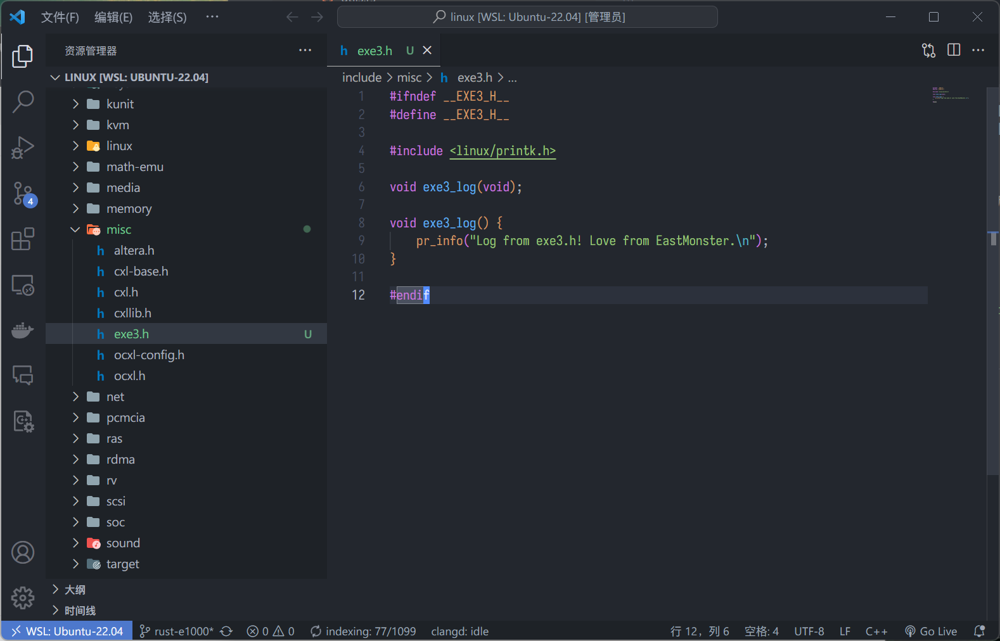
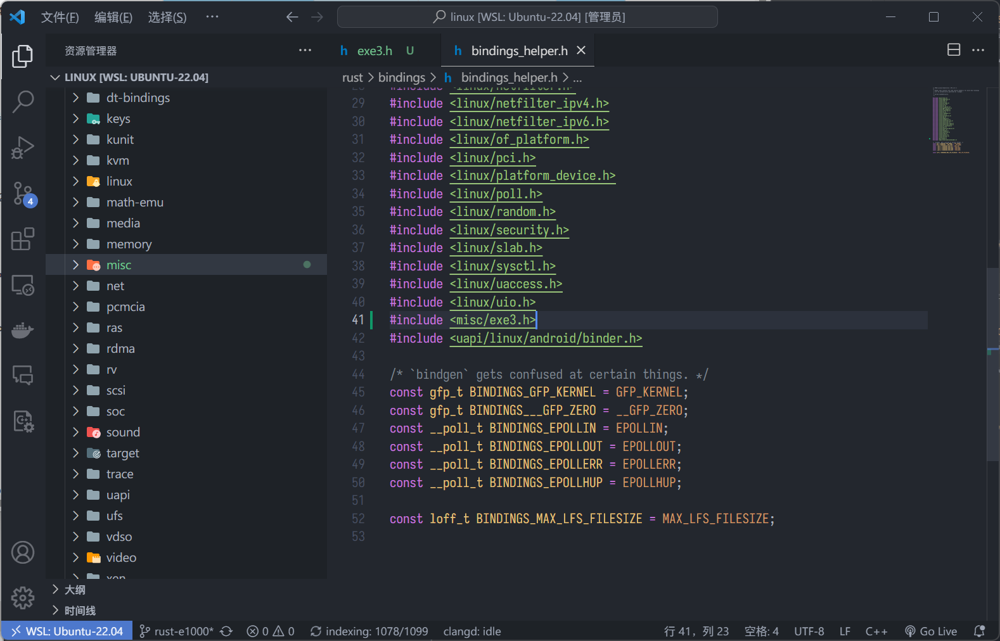
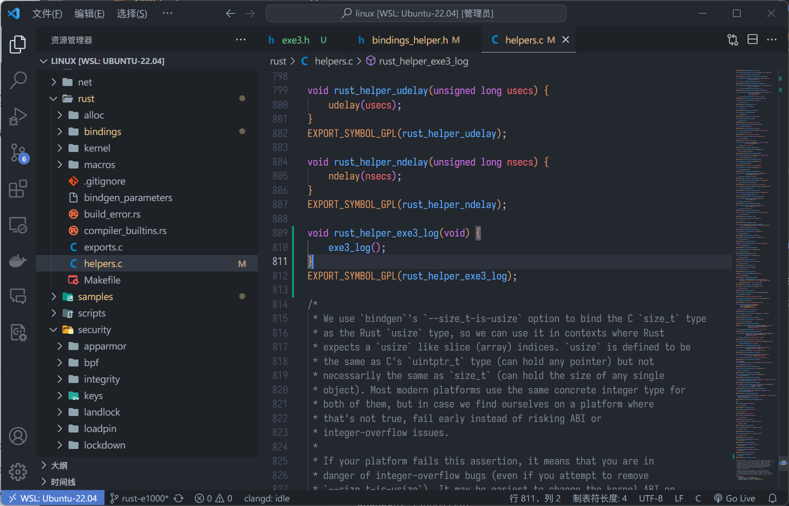
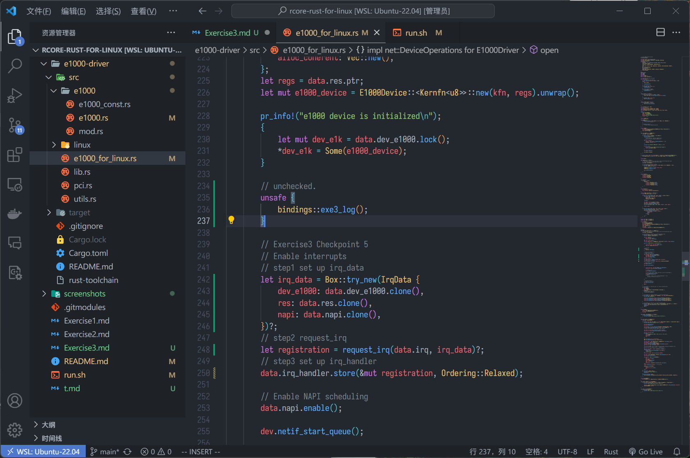
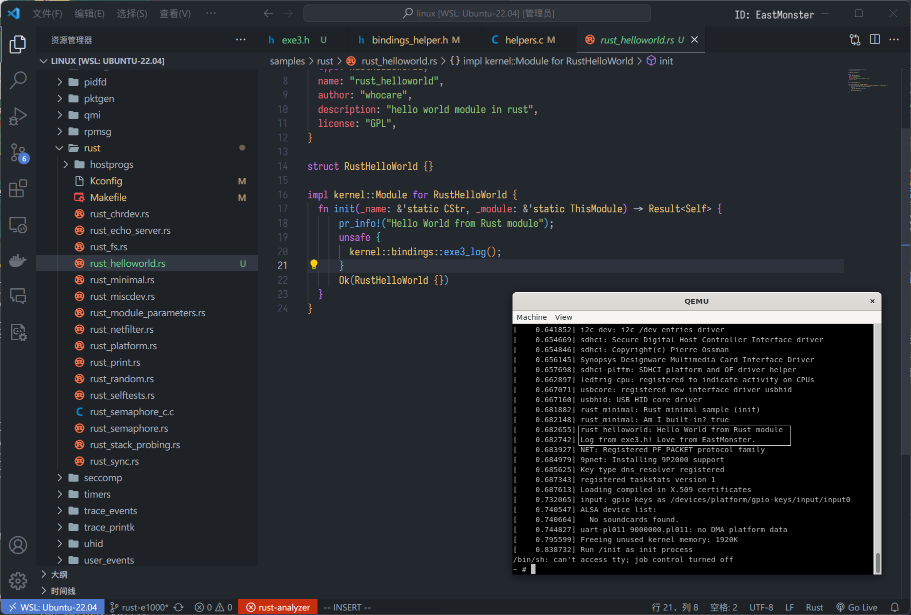

## 练习 3.1: 基于 QEMU 模拟器上的 e1000 网卡驱动框架, 填充驱动初始化函数

代码更改在 e1000-driver 仓库中.  

## 练习 3.2: 自定义一个 Linux 内核函数, 并在 Rust 模块中调用它


### Step 1

新建一个头文件 `exe3.h`, 里面打印了一条语句:  


### Step 2

在 `bindings_helper.h` 中把 `exe3.h` 引用进来:  


在 `helper.c` 中添加 `rust_helper_exe3_log` 函数:  


### Step 3



#### 附注

暂时无法验证 Step 3 调用 bindings 自定义函数执行的正确性, 因为练习 4 还没有完成, 无法通过编译. 不过我在练习 2 的 `helloworld` 模块里添加了调用, 并成功输出结果:  


1. 移除 e1000 驱动  
   
   在 menuconfig 中查找 e1000 相关选项, 禁用之, 重新编译内核.  

2. 生成 `compile_commands.json`:  

   ```bash
   # pwd: linux/
   ./scripts/clang-tools/gen_compile_commands.py -d build/
   ```