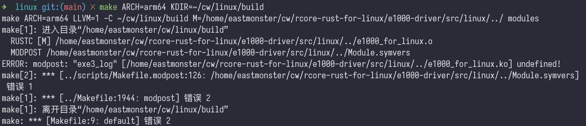

## 练习 4: 完成 e1000 网卡收包和发包函数

代码更改在 e1000-driver 仓库中.  

1. 把生成的 `e1000_for_linux.ko` 复制到放置文件系统的文件夹下, 重新制作文件系统, 启动 QEMU. 在启动脚本中加上两行:  
   ```
   -device e1000,netdev=net0,bus=pcie.0 \
   -netdev user,id=net0 \
   ```

2. 加载驱动
   ```bash
   insmod e1000_for_linux.ko
   ```

3. 启用设备
   ```bash
   ip link set eth0 up
   ```
   

4. 分配网关, 设置 IP 地址
   ```bash
   ip addr add 10.0.2.20/24 dev eth0
   ip route add default via 10.0.2.2 dev eth0
   ```

5. 执行 `ping 10.0.2.2`, 查看结果  
   


#### 附注

1. 给 Linux 内核代码启用 rust-analyzer 支持 (感觉没啥用)
   
   先给 Linux 内核生成一份 `rust-project.json`
   ```bash
   # pwd: ../linux
   make ARCH=arm64 LLVM=1 O=build rust-analyzer
   ```

   > bindings 没提示...

2. 关于练习 3 遗留的验证

   编译过不去, 提示 `modprobe ... undefined`, 把 `bindings::exe3_log()` 去掉就能编译了, 原因不明.  
   
